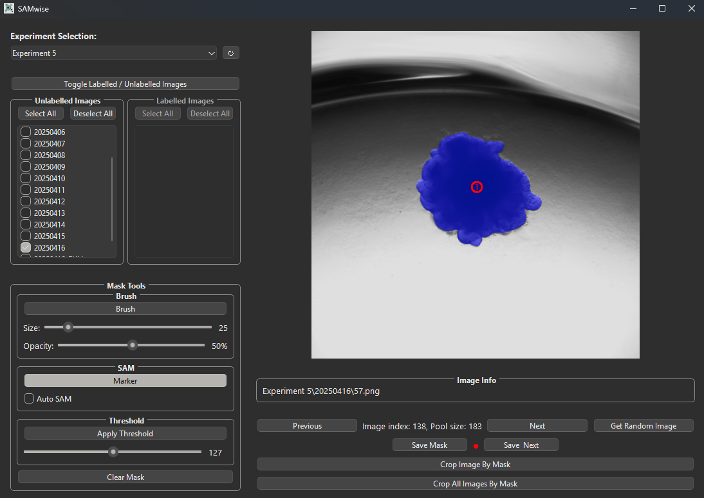

# SegmentWise

<div align="center">
  
</div>

SegmentWise is a professional desktop application designed for precise segmentation of biological images, with a particular focus on organoid and cell datasets. The software provides a streamlined environment that combines manual drawing tools, threshold-based segmentation, and integration with the Segment Anything Model (SAM) for semi-automated annotation.

The application is built to support the complete workflow of image annotation in research settings. It allows users to organise images by experiments and dates, manage labelled and unlabelled datasets, and track progress throughout the annotation process. Segmentation can be performed using manual brush tools, automatic thresholding, or AI-assisted methods such as marker-guided SAM and fully automated SAM predictions.

By uniting these complementary approaches in a single interface, SegmentWise reduces the time and variability associated with biological image annotation, while maintaining full user control and transparency. It is intended to provide both flexibility for expert annotators and efficiency for large-scale studies.

<div align="center">
  
  <p><em>Screenshot of SegmentWise in use: an organoid image being segmented with AI-assisted annotation tools.</em></p>
</div>

## Features

### Image Management
- **Multi-experiment support**: Organize images by experiment and date folders
- **Smart folder navigation**: Switch between labeled and unlabeled image pools
- **Batch operations**: Crop multiple images by their masks simultaneously
- **Progress tracking**: Visual indicators for annotation completion status

### Annotation Tools
- **Manual drawing**: Brush tool with adjustable size and opacity
- **Threshold segmentation**: Automatic mask generation based on intensity thresholds
- **SAM integration**: Semi-automated segmentation using Meta's Segment Anything Model
- **Auto SAM**: Intelligent automatic mask generation for the largest object in images
- **Marker-based SAM**: Precise segmentation with user-placed markers

### User Interface
- **Intuitive workflow**: Streamlined interface designed for efficient annotation
- **Real-time preview**: Immediate visual feedback for all operations
- **Modular design**: Clean separation of tools and controls
- **Professional logging**: Comprehensive error tracking and debugging

## Installation

### Prerequisites
- Python 3.8 or higher
- CUDA-compatible GPU (recommended for SAM functionality)

### Dependencies
Install the required packages using pip:

```bash
pip install -r requirements.txt
```

### SAM Model Setup
The application uses Meta's Segment Anything Model (SAM). To enable SAM functionality:

1. Download a SAM checkpoint file from the [official repository](https://github.com/facebookresearch/segment-anything)
2. Place the checkpoint file in the `Models/` folder within the root directory
3. Ensure the filename matches the expected checkpoint name in the configuration (default is "sam_vit_h_4b8939.pth")

**Note**: SAM is licensed under Apache 2.0, which permits both research and commercial use with proper attribution.

## Usage

### Starting the Application
```bash
python src/main.py
```

### Basic Workflow
1. **Select Experiment**: Choose from available experiments in the dropdown
2. **Choose Folders**: Select which date folders to process from the experiment
3. **Load Images**: Click "Get Random Image" to start annotation
4. **Create Masks**: Use the available tools to segment organoids:
   - **Brush**: Manual drawing with adjustable parameters
   - **Marker + SAM**: Place markers for SAM-based segmentation
   - **Auto SAM**: Automatic segmentation of the largest object
   - **Threshold**: Intensity-based automatic segmentation
5. **Save Work**: Save masks and move to the next image

### File Structure
The application expects the following directory structure:
```
project_root/
├── Data/
│   └── Experiment X/
│       └── YYYYMMDD/
│           ├── 1.png
│           ├── 2.png
│           └── ...
├── Labels/ (Automatically created)
│   └── Experiment X/
│       └── YYYYMMDD/
│           ├── 1.png (masks)
│           ├── 2.png
│           └── ...
├── Cropped/ (Automatically created)
│   └── Experiment X/
│       └── YYYYMMDD/
│           ├── 1.png (cropped images)
│           ├── 2.png
│           └── ...
├── Models/
│   └── sam_vit_h_4b8939.pth (SAM checkpoint)
└── logs/
    └── organoid_segmentation_YYYYMMDD.log
```

## Architecture

### Core Components
- **Main Window**: Central UI coordination and workflow management
- **Drawing Canvas**: Image display, drawing tools, and user interactions
- **Service Layer**: Business logic separation for images, experiments, and models
- **Event System**: Decoupled communication between components

### Key Services
- **ExperimentService**: Manages experiment detection and folder organization
- **ImageManager**: Handles image pools, navigation, and mask operations
- **ModelService**: SAM model loading, initialization, and prediction
- **AutoSamService**: Automatic mask generation using image analysis

### UI Components
- **ExperimentManager**: Experiment selection and configuration
- **FolderManager**: Folder selection and view mode switching
- **DrawingTools**: Tool selection and parameter controls
- **ImageControls**: Navigation, saving, and batch operations
- **ImageInfo**: Display current image information

## Technical Details

### Supported Image Formats
- PNG, JPG, JPEG, BMP, TIFF, TIF
- Automatic format detection and conversion

### Performance Optimizations
- **Lazy SAM loading**: Models are loaded on-demand to improve startup time
- **Smart pool management**: Image lists are refreshed intelligently to maintain accuracy
- **Efficient rendering**: Optimized canvas operations for smooth interaction
- **Memory management**: On-demand model cleanup with GPU memory optimization

### Error Handling & Logging
- **Professional logging system**: Rotating log files with configurable levels
- **User-friendly error messages**: Clear feedback for common issues
- **Robust file I/O**: Comprehensive error checking and recovery
- **Debug capabilities**: Detailed logging for troubleshooting

## Development

### Project Structure
```
segmentwise/
├── .gitignore                    # Git ignore patterns
├── README.md                     # Project documentation
├── requirements.txt              # Python dependencies
├── Models/                       # SAM model checkpoints
├── logs/                         # Application logs
├── Data/                         # Raw experiment images
├── Labels/                       # Segmentation masks
├── Cropped/                      # Processed images
└── src/                          # Source code
    ├── main.py                   # Application entry point
    ├── core/                     # Core architecture
    │   ├── __init__.py
    │   ├── base.py              # Base classes and enums
    │   └── events.py            # Event system implementation
    ├── models/                   # Data models
    │   ├── __init__.py
    │   └── experiment.py        # Experiment data structures
    ├── services/                 # Business logic layer
    │   ├── __init__.py
    │   ├── experiment_service.py # Experiment management
    │   ├── image_manager.py     # Image operations
    │   ├── model_service.py     # SAM model integration
    │   └── auto_sam_service.py  # Automatic segmentation
    ├── ui/                       # User interface
    │   ├── __init__.py
    │   ├── main_window.py       # Main application window
    │   ├── drawing_canvas.py    # Canvas for image display/drawing
    │   ├── placeholder_image.py # Placeholder image generation
    │   └── components/          # Reusable UI components
    │       ├── __init__.py
    │       ├── drawing_tools.py # Drawing tool controls
    │       ├── experiment_manager.py # Experiment selection
    │       ├── folder_manager.py # Folder selection
    │       ├── image_controls.py # Image navigation/controls
    │       └── image_info.py    # Image information display
    └── utils/                    # Utility functions
        ├── __init__.py
        ├── image_processing.py  # Image manipulation helpers
        └── logging_config.py    # Logging configuration
```

### Key Design Patterns
- **Model-View-Controller (MVC)**: Clear separation between data, UI, and logic
- **Observer Pattern**: Event-driven communication between components
- **Service Layer Pattern**: Business logic encapsulation
- **Singleton Pattern**: Centralized event bus and configuration

### Adding New Features
1. **Business Logic**: Implement in appropriate service classes
2. **UI Components**: Create following established component patterns
3. **Communication**: Use the event system for decoupled messaging
4. **Error Handling**: Add comprehensive logging and user feedback
5. **Testing**: Include unit tests for critical functionality

### Code Quality
- **Professional logging**: Structured logging with rotating files
- **Error handling**: Comprehensive exception management
- **Documentation**: Clear docstrings and inline comments
- **Modularity**: Clean separation of concerns
- **Type hints**: Enhanced code clarity and IDE support

## License

This project is open source and available under the MIT License.

### Third-Party Licenses
- **Segment Anything Model (SAM)**: Licensed under Apache 2.0 by Meta Platforms, Inc.
- **PySide6**: Licensed under LGPL
- **OpenCV**: Licensed under Apache 2.0
- **NumPy**: Licensed under BSD
- **scikit-image**: Licensed under BSD

## Contributing

Contributions are welcome! Please feel free to submit pull requests or open issues for bugs and feature requests.

### Development Setup
1. Clone the repository
2. Install dependencies: `pip install -r requirements.txt`
3. Download SAM model checkpoint
4. Run the application: `python src/main.py`

## Citation

If you use SegmentWise in your research, please cite:

```bibtex
@software{segmentwise2025,
  title={SegmentWise},
  author={Sammy Shorthouse and Aya Elghajiji and Qiang Liu and James Armstrong},
  year={2025},
  url={https://github.com/SammySho/SegmentWise}
}
```

## Acknowledgments

- Meta AI for the Segment Anything Model
- The Qt Company for PySide6
- The scientific Python community for the excellent libraries that make this application possible
- ChatGPT (OpenAI) for creating the application logo